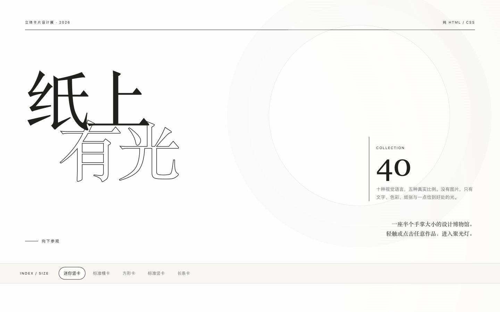
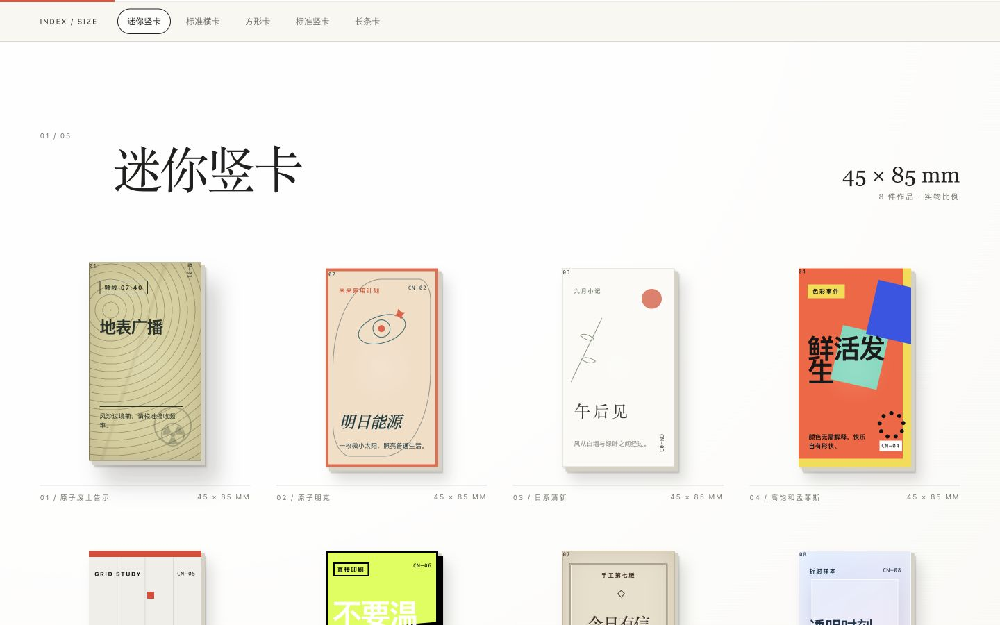
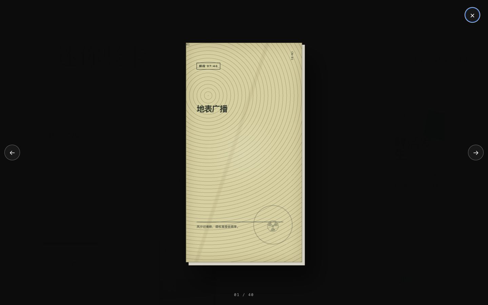

# 纸上有光｜立体卡片设计展

> 给设计初学者、视觉设计师和创意开发者的一座微型参考博物馆：把抽象的“设计感”，还原成可以比较、观察和运行的比例、层次、材质与交互。

**[进入在线展览 →](https://kie70.github.io/paper-light-card-exhibition/)**

## 为什么做这个展览

看到一张漂亮的设计并不难，难的是回答：**它为什么成立？**

很多灵感网站把不同尺寸、用途和语境的作品混在一起。初学者很容易记住表面的颜色，却看不见比例、留白、信息层级和材质如何共同发挥作用。“纸上有光”把这些变量放回同一个可比较的展览系统中：40 张卡片按照真实印刷比例陈列，让你能连续观察同一尺寸如何容纳完全不同的视觉语言。

这不是素材下载站，也不是一组只换颜色和文案的模板。它更像一间可以反复走进的练习室，帮助你建立自己的视觉判断。

## 它能为你带来什么

### 如果你正在学习设计

- 在同一尺度下比较十种风格，区分“风格元素”和“底层秩序”。
- 观察字号、留白、对齐、色彩面积与视觉重心如何随比例改变。
- 理解立体感不只来自阴影，也来自纸边、压印、叠层、折射和高光方向。
- 从 70% 清晰易读与 30% 实验构图之间，找到可借鉴与可突破的边界。

### 如果你从事视觉或品牌工作

- 获得一组适配中文排版语境的卡片参考，而不是生硬套用拉丁字母模板。
- 快速比较日系、瑞士、粗野、孟菲斯、原子朋克等语言在小尺寸媒介中的表现。
- 把它当作情绪板、提案前的方向筛选器，或团队讨论设计语言时的共同参照。

### 如果你是前端或创意开发者

- 查看纯 CSS 如何模拟纸张、金属、亚克力、旧化与活版压印。
- 参考指针驱动的 3D 倾斜、移动高光、原生 `dialog` 查看器和响应式展览布局。
- 整个作品只有一个 `index.html`，无需框架、构建工具或依赖，适合直接阅读和拆解。

## 四十张卡片，五种真实比例

| 尺寸章节 | 实物比例 | 适合观察什么 |
| --- | --- | --- |
| 迷你竖卡 | 45 × 85 mm | 狭窄空间中的信息取舍与纵向节奏 |
| 标准横卡 | 90 × 54 mm | 名片尺度中的横向层级与视觉动线 |
| 方形卡 | 70 × 70 mm | 中心构图、几何秩序与视觉张力 |
| 标准竖卡 | 60 × 90 mm | 海报语言如何压缩进掌心尺寸 |
| 长条卡 | 45 × 100 mm | 极端比例中的阅读方向与留白控制 |

每个章节包含 8 张作品，共覆盖 10 个视觉家族：

`原子废土` · `原子朋克` · `日系清新` · `高饱和孟菲斯` · `瑞士国际主义` · `粗野主义` · `活版印刷` · `半透明亚克力` · `金属工业铭牌` · `超现实编辑`

每类风格恰好出现 4 次，并被分散到不同尺寸中。因此你看到的是风格在不同约束下的变化，而不是四张换色复制品。

## 一场可以触摸的线上展览

鼠标经过卡片时，倾角、高光与阴影会跟随指针移动；点击作品后，它会离开展览墙，进入深色聚光灯空间。你可以用左右方向键连续观看，用 `Esc` 返回展厅。

手机和平板会自动调整为双列或三列陈列。系统开启“减少动态效果”时，复杂旋转会被关闭，但浏览和查看功能保持完整。

## 设计与技术原则

- **内容先于效果：** 40 张卡片均有独立中文文案、构图与视觉重心。
- **约束产生创造：** 所有作品都在五种真实物理比例中完成。
- **材质由结构产生：** 纸张、压印、旧化、折射、套印偏移和金属反光全部由 CSS 构成。
- **不把图片当捷径：** 没有图片、外部字体、前端框架或生成式图片模型。
- **尊重原创边界：** 原子废土作品只借鉴复古核能宣传与工业视觉语言，不使用现成游戏角色、Logo 或受版权保护的图像素材。

## 如何使用

### 在线参观

打开 **[GitHub Pages 展览](https://kie70.github.io/paper-light-card-exhibition/)**，向下滚动即可开始。

### 离线参观

下载仓库中的 [`index.html`](./index.html) 并直接打开。页面不发起任何外部资源请求，断网也能完整运行。

### 作为学习样本

你可以从 `cards` 数据开始理解内容组织，再查看 `.style-*` 与 `.v0`—`.v3` 如何把十套风格扩展为四十种构图。建议先观察成品并写下自己的判断，再阅读代码验证，而不是一开始就复制样式。

---

**形式不是装饰。** 比例、间距、层次与材料感，共同决定一张小卡片如何被看见、理解与记住。
